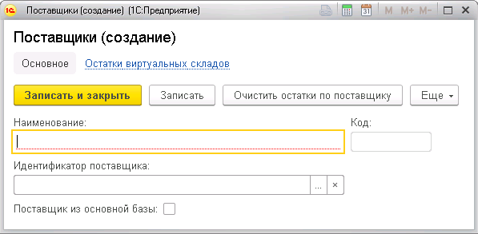

# Основные параметры загрузки

Для создания новой настройки на начальной странице выберите соответствующий пункт в правой области.

После чего откроется форма создания новой настройки.

В шапке настройки необходимо заполнить 3 обязательных реквизита:

1. Поставщик
2. Наименование настройки
3. Валюта

## Основные параметры загрузки

### Поставщик

Нажмите на выпадающий список в поле выбора поставщика.

Выберите из списка или создайте нового поставщика. Для добавления поставщика нажмите на кнопку "+".


В списке выбора отображаются последние поставщики, которые использовались в настройках прайс-листов. Для того, чтобы увидеть всех поставщиков нажмите "Показать все"


### Создание поставщика

При нажатии на "+" откроется форма создания поставщика.

Введите наименование поставщика \(как он будет отображаться в Виртуальном складе\).


Если Виртуальный склад подключен к основной базе 1С, то необходимо выбрать поставщика из основной базы.


Для выбора поставщика из основной базы нажмите на "..." в поле ввода идентификатора поставщика.

В открывшейся форме найдите необходимого поставщика и выберите его.

В результате в поле "Идентификатор поставщика" подставится уникальный код этого поставщика, а также необходимо убедиться, что установлена галка "Поставщик из основной базы"

### Наименование загрузки

Наименование загрузки может быть любым и носит информационный характер. Например, если от одного поставщика приходит несколько прайс-листов с остатками на разных складах, то мы можем указать это в названии настройки, для удобства идентификации и выбора.

### Валюта прайс-листа

Выберите валюту из выпадающего списка.

### Добавление валюты

Для добавления валюты необходимо перейти в справочник "Валюты" с помощью меню.

В открывшемся справочнике нажмите "Создать" и выберите "По классификатору".

Найдите в списке нужную валюту и выберите ее.

После добавления валюта будет доступна для выбора в настройке загрузки.

## Параметры получения файлов

Следующим этапом является настройка источника.

В зависимости от выбранного варианта получения файлов доступны соответствующие маски.

### Инструкция по использованию маски

Следующие символы в строке шаблона являются служебными и имеют смысл, отличный от символа строки:

* **% \(процент\)**: последовательность, содержащая любое количество произвольных символов
* **\_ \(подчеркивание\)**: один произвольный символ
* **\[…\] \(в квадратных скобках один или несколько символов\)**: любой одиночный символ из перечисленных внутри квадратных скобок В перечислении могут встречаться диапазоны, например a-z, означающие произвольный символ, входящий в диапазон, включая концы диапазона. 
* **\[^...\]\(в квадратных скобках значок отрицания, за которым следует один или несколько символов\)**: любой одиночный символ, кроме тех, которые перечислены следом за значком отрицания

Любой другой символ означает сам себя и не несет никакой дополнительной нагрузки.

Если в качестве самого себя необходимо записать один из перечисленных символов, то ему должен предшествовать &lt;Спецсимвол&gt;. Сам &lt;Спецсимвол&gt; \(любой подходящий символ\) определяется в этом же операторе после ключевого слова СПЕЦСИМВОЛ.

Например, шаблон “%АБВ\[0-9\]\[абвг\]\абв%” СПЕЦСИМВОЛ “\” означает подстроку, состоящую из последовательности символов: буквы А; буквы Б; буквы В; одной цифры; одной из букв а, б, в или г; символа подчеркивания; буквы а; буквы б; буквы в.

Причем перед этой последовательностью может располагаться произвольный набор символов.

### Электронная почта \(e-mail\)

Обязательным для заполнения является лишь адрес электронной почты, остальные параметры позволяют выбрать нужные письма, используя маски по:

* Теме письма
* Наименованию архива
* Наименованию файла \(в письме или в архиве\)

Для получения прайс-листа в соответствии с указанными настройками нажмите "Получить файлы по электронной почте". В результате загруженные файлы появятся в табличной части.

### Каталог в файловой системе

В качестве источника можно также использовать локальный каталог.

В этом случае необходимо указать путь к каталогу и маску наименования файла.

Для получения прайс-листа в соответствии с указанными настройками нажмите "Получить файлы из каталога". В результате загруженные файлы появятся в табличной части.

### Ручное добавление

Для ручного добавления необходимо выбрать необходимый файл вручную.

### Список файлов. Открытие файла в 1С

В результате выбора параметров получения файлов и после их получения, в списке в списке будут доступны файлы.


Если в списке файлов нет файлов, значит указанным параметрам не соответствует ни один файл.


После загрузки файла есть возможность открыть его в 1С для того, чтобы проверить, как он открывается внутренними средствами платформы 1С. Для этого нажмите "Открыть файл в 1С"

## Общие настройки обработки файлов

После настройки параметров получения файлов необходимо проверить общие настройки обработки.

### Вариант рахархивирования файлов

Настройка используется в тех случаях, когда прайс-лист приходит в архиве без расширения, но на самом деле это zip-архив. В этом случае необходимо выбрать "Разархивировать как zip-архив".


Во всех остальных случаях достаточно оставить параметр "Определять по расширению"


### Формат загрузки

Данной настройкой стоит воспользоваться в том случае, когда формат файла не соответствует его расширению.

Например, поставщик при формировании прайс-листа использует текстовый формат с разделителями \(что соответствует формату csv\), а в расширении указывает xls. В этом случае необходимо выбрать действительный формат.


Во всех остальных случаях достаточно оставить параметр "Определять по расширению"


### Кодировка текста

Данной настройкой стоит воспользоваться, если системная кодировка не соответствует кодировке в файле.


Во всех остальных случаях достаточно оставить параметр "Системная"


### Дополнительные параметры

* **Строка шапки** - может использоваться как отдельный параметр при настройке загрузки колонок.
* **Первая и последняя строка** - диапазон загрузи строк. \(0 - до конца документа\)
* **Первый и последний лист** - какие листы загружаем из файла.
* **Разделитель колонок** - можно указать нестандартный разделить для прайс-листов в текстовом формате \(по-умолчанию ";"\)/
* **Загружать позиции без количества** - параметр, который позволяет настроить загрузку предложений без количества \(под заказ\) из прайс-листа поставщика.

